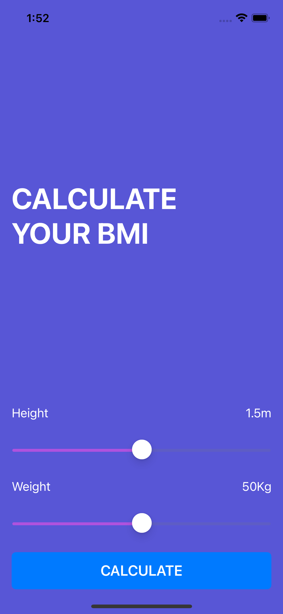
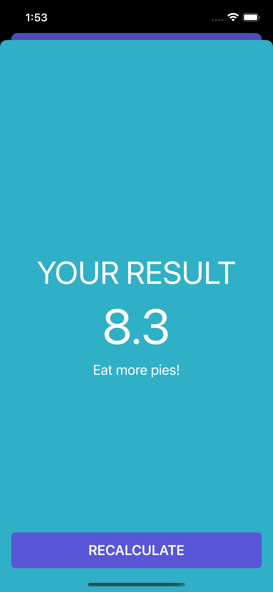
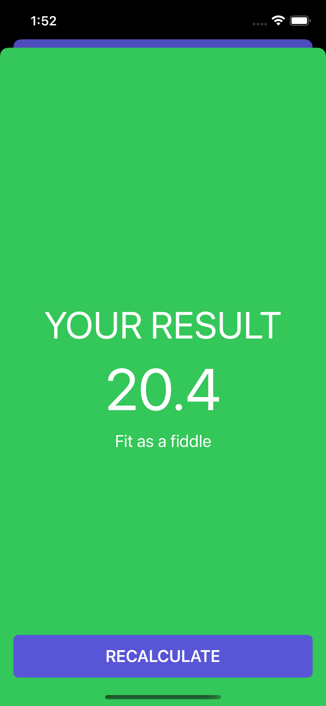
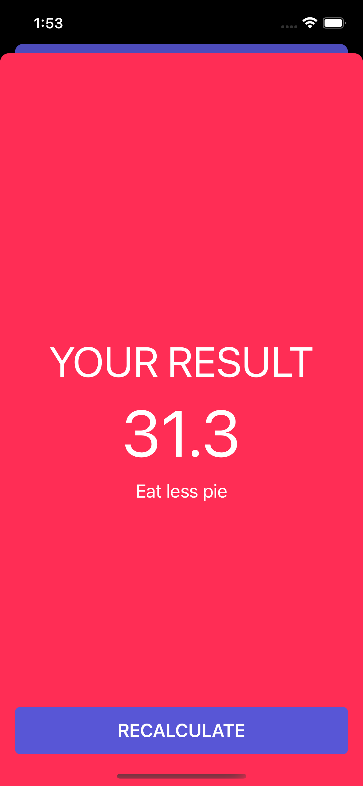

# BMI-Calculator

Based on the user's weight and height, the Body Mass Index calculator will calculate body mass and give a piece of health advice.

 
<h3>Use the sliders to input weight and height. Then, press the Calculate button.</h3>

 
<h3>Low BMI Value</h3>

 
<h3>Normal BMI Value</h3>

 
<h3>High BMI Value</h3>

